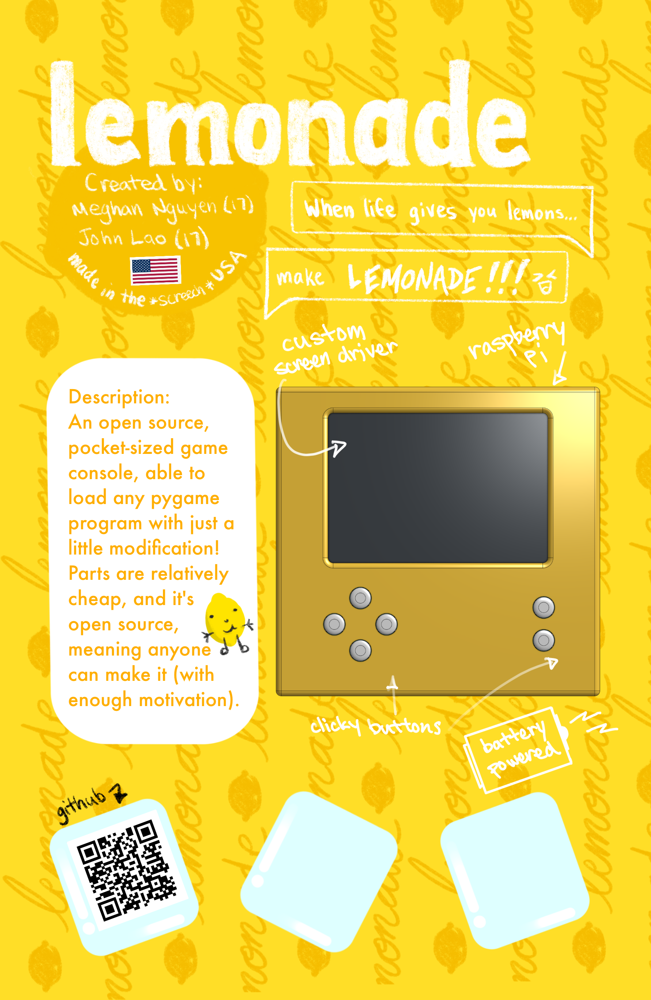
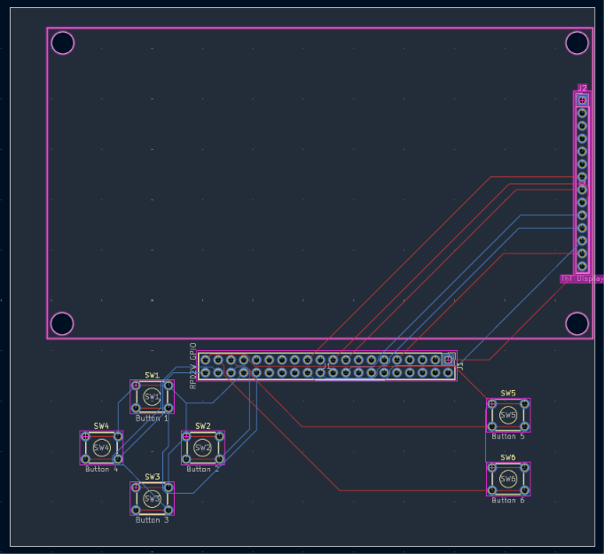
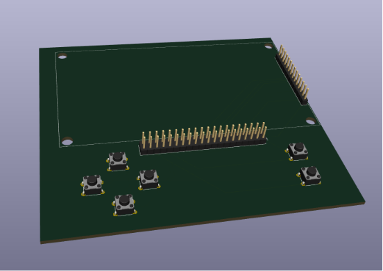

# Lemonade



An open source, pocket-sized game console, able to load any pygame program with just a little modification! Parts are relatively cheap, and it's **open source**, meaning anyone can make it (with enough movitvation)! 

## Use

**THIS BRANCH IS THE DESKTOP VERSION. PLEASE SWITCH BRANCHES TO "console" FOR THE CONSOLE VERSION IN THE EVENT YOU ARE BUILDING IT**

### Installation

To be completely honest, this branch is just to test code and logic before going into the tft display, but I got the idea to make a desktop version!

To install, simply clone this repo and run the Home.py file, and kaboom! Running Lemonade OS. 

## Making your own GAME :O

If you want to make your OWN PERSONAL CUSTOM GAME (or have a folder of one already), follow these steps to ensure you encounter the least amount of roadblocks to get it up and running.

### 1. Install VSCode

It's a nice IDE to have and works well when editing things

### 2. Access the assets folder inside Lemonade

This is where each individual game is.

### 3. Move (or copypaste) your game folder into the assets folder

Make sure your game class has a run function, and be sure that it doesn't call it at the end of the game file!

### 4. Modifying Home.py

Inside Home.py, at the top, you'll see many many imports. 
Add an import to your game. It should look something like

```
from [game folder].[game file] import [game class]
```

Then, go down to somewhere around line 55. Notice how this is where all the games executions happen. Since there are only 4 slots, choose one game to replace. Game1 is the Ninja Platformer, Game2 is Snake Game, Game3 is Sudoku, and Game4 is Tetris. Replace one of the ```Game[number]().run()``` with your own ```[your game class]().run()```

Then, boot up Home.py and switch to the tile your game replaced (using arrow keys) and hit x to launch.

Tada!! You have now added your own game to Lemonade :)

## Why?
You might be asking yourself, why make this in the first place??

Well, here's your answer. Cheapish game consoles don't really exist anymore. the 3DS and gameboy aren't really around (albeit people still have them), and the nintendo switch or steamdeck is just wayyy too much, not only in terms of price, but also in size. The Playdate is the size exception, but not the price exception. Making this an open source project allows people to make their own games, learn pygame, and be able to use it for entertainment!

Lemonade in essence extends opportunity in python coding to people who may not have much experience, especially in the desktop version! It is able to act as a medium for people to share and make games and play them. 

## Images

.png)

.png)





.png)

