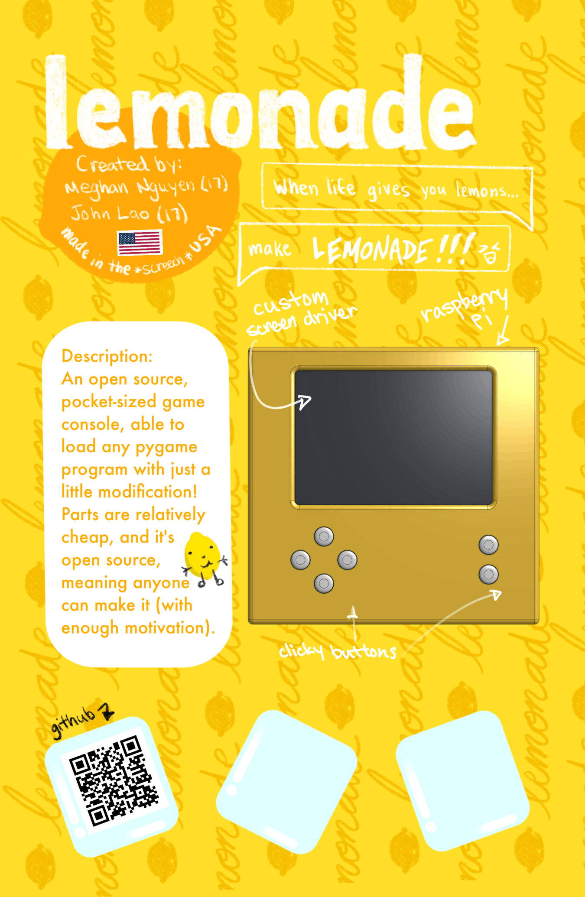

# Lemonade

An open source, pocket-sized game console, able to load any pygame program with just a little modification! Parts are relatively cheap, and it's **open source**, meaning anyone can make it (with enough movitvation)!

## Use
**BEFORE ASSEMBLING COMPONENTS, PLEASE FOLLOW THE USE IN https://github.com/laojoh/Lemonade-Driver,** it will help guide the initial TFT SPI Display set up process. 

## Why?
You might be asking yourself, why make this in the first place??

Well, here's your answer. Cheapish game consoles don't really exist anymore. the 3DS and gameboy aren't really around (albeit people still have them), and the nintendo switch or steamdeck is just wayyy too much, not only in terms of price, but also in size. The Playdate is the size exception, but not the price exception. Making this an open source project allows people to make their own games, learn pygame, and be able to use it for entertainment!

